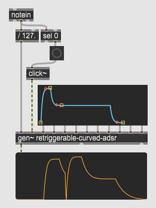

[English](README.MD)

## これは何?
Genで実装したADSRエンベロープです。
`live.adsrui`と接続して使用すること、`adsr~`と`live.adsr~`の機能を合わせ持つことを念頭に置いています。

## 動作環境
Max 8.3.0以上が必要です。8.2.xでも動作しますが、タイミングが正確でなく、プチノイズが発生する可能性があります。

## 使用方法
`gen~`オブジェクトを作成し、gendspファイルを読み込みます。
ノートオン・オフから求めた振幅、リトリガー用のパルスシグナル、`live.adsrui`オブジェクトからの出力を`gen~`の入力につなぎます。 

詳しくはサンプルパッチ (retriggerable-adsr-sample.maxpat) を参照ください。

## 入力メッセージ
- loopmode [整数]: エンベロープのモードを切り替えます。`live.adsr~`のメッセージと同等です。  
  0: 通常のADSR (既定) 
  1: トリガーモード (`adsr~`のplay to end mode) 
  2: ループモード

- legato [整数]: エンベロープ動作中にノートオンシグナルを受信した際の挙動を切り替えます。`adsr~`のメッセージと同等です。 
  0: リトリガーモード (既定) 
  0以外: レガートモード 

- retrigger [浮動小数]: リトリガーの時間をミリ秒で指定します。`adsr~`のメッセージと同等です。.

- speed [浮動小数]: エンベロープ速度の割合を指定します。ヴェロシティやノート番号に対してエンベロープの長さを変えたい (標準オブジェクトの'Time\<Vel') 場合に使用します。 (既定値=1.0)

- 浮動小数 / シグナル 
  - 第1インレット: ノートオン・オフに対する振幅を0から1の範囲で入力します。 
  - 第2インレット: リトリガー用のトリガーインプットです。`click~`オブジェクトから出力されたパルス信号を入力する必要があります。
  - 第3インレット: アタック時間 (以降は`live.adsr~`の入力と同等です)
  - 第4インレット: ディケイ時間
  - 第5インレット: サスティンの振幅
  - 第6インレット: リリース時間
  - 第7インレット: エンベロープ開始時の振幅
  - 第8インレット: アタック終了・ディケイ開始時の振幅
  - 第9インレット: リリース終了時の振幅
  - 第10インレット: アタックのカーブ具合
  - 第11インレット: ディケイのカーブ具合
  - 第12インレット: リリースのカーブ具合

## 出力
- 第1アウトレット: エンベロープのシグナル。
- 第2アウトレット: エンベロープ生成中の場合1を出力します。`live.adsr~`の第2アウトレットと同等です。 
  \<ヒント\> この出力と`edge~`オブジェクトを組み合わせて、`thispoly~`に入力する`mute`メッセージを作ることができます。 
  もしくは、`mc.noteallocator~` に対して使用できます。(サンプルパッチ内の `mc` タブを参照)
- 第3アウトレット: リリース中を除き、エンベロープ生成中の場合に1を出力し、それ以外の場合1を出力します。`adsr~`の第2アウトレットと同等です。

## その他
- カーブの形状は`live.adsr~`と完全には一致しません。
